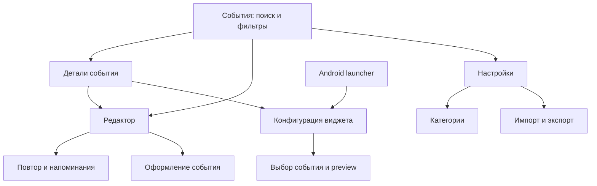
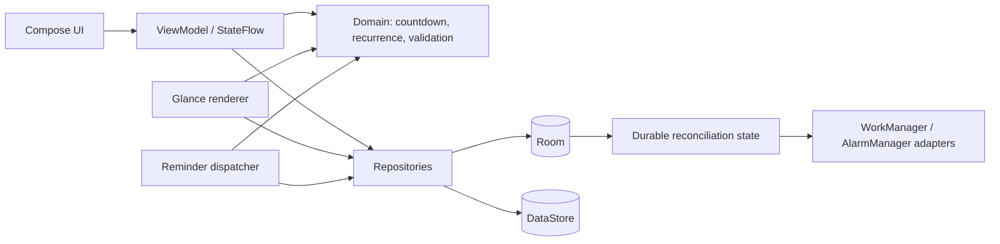

# «Обратный отсчёт» — продуктовая и техническая архитектура

Архитектурная спецификация v1, 2026-09-15. Основание — мастер-промпт пользователя и девять скриншотов; уточнение пользователя: **только русский и английский языки**.

Документ задаёт одну рекомендуемую архитектуру. Продукт ещё не реализован. «Поддержать», «делаем» и критерии ниже описывают целевое поведение, а не результаты испытаний. Проверенные положения Android отделены ссылками от проектных решений. Реестр источников и непроверенных интеграционных деталей — [SOURCES.md](SOURCES.md).

## 1. Phase 1 — Executive Summary

Создаём локальный Android event tracker с сильными домашними виджетами. Главная ценность — быстро записать важную дату и затем надёжно видеть её приближение. Личность события задают иконка, цвет и типографика. Фотографий и растровых фонов нет.

Рекомендация:

- Android 8.0+ (`minSdk 26`), основной целевой Android 16 (`targetSdk 36`, `compileSdk 36`).
- Kotlin, Compose, Material 3, Navigation Compose; одна основная Activity и маленькая отдельная Activity для системного контракта настройки виджета.
- Два модуля: `:app` и чистый Kotlin/JVM `:core:domain`. Room хранит события и конфигурации, DataStore — настройки приложения.
- Единый чистый CountdownEngine с явными `Clock`, `ZoneId`, правилами recurrence; время не хранится как уменьшающийся счётчик.
- Glance и четыре стиля виджетов: Minimal, Standard, Progress, Calendar. Предопределённые responsive размеры, без привязки к числу ячеек launcher.
- WorkManager — отложенные пакетные обновления и восстановление согласованности. Один ближайший inexact AlarmManager alarm — пользовательские напоминания. Exact alarms в v1.0 отсутствуют.
- Только RU/EN, светлая/тёмная/системная тема, Dynamic Colors на поддерживаемых устройствах, локальный JSON backup через системный выбор файла.

**Главные ограничения продукта:** виджет не является секундомером; уведомление не обещает точность будильника; оформление ограничено RemoteViews и launcher. Это отражается в настройках, а не маскируется постоянной фоновой работой. Обновления Glance требуют пересоздания и передачи RemoteViews; документированные периодические интервалы — от 30 минут для metadata и от 15 минут для WorkManager. [Android Developers: Glance updates](https://developer.android.com/develop/ui/compose/glance/glance-app-widget)

## 2. Phase 2 — Requirements Audit

| Требование | Решение и граница |
| --- | --- |
| Production-ready | Критерий релиза M10, не синоним архитектурного документа |
| Android 16 / API 36 | Целевая платформа; не причина исключать все API <36 |
| Современный стек | Stable зависимости, зафиксированные версии, без alpha в runtime |
| Полная offline работа | Нет INTERNET, аккаунтов, backend, telemetry; SAF работает с локальными файлами |
| Пользовательские изображения | Не входят в модель, storage, permissions или backup |
| Только русский и английский | Полный паритет UI/widget/notification; `values` = EN, `values-ru` = RU |
| Обычное создание за 10–15 секунд | Проверяемая UX-гипотеза; не обещание без исследования |
| Seconds countdown | Только пока открыт соответствующий экран; один источник обновлений |
| Smart widget updates | Вычисляем смысловую границу, ОС может выполнить работу позже |
| Весь день / timezone / DST | Три явных временных режима, описанных в §7–8 |
| Custom recurrence | v1.0: каждые N календарных дней; weekdays и month-end; полный RRULE позже |
| После наступления | Elapsed, completed, auto-archive либо следующая итерация; политика хранится |
| Четыре widget styles | Все четыре в v1.0; Calendar — собственная сетка, без доступа к календарю |
| Цвета / шрифты / радиус | Ограниченные пресеты с fallback; произвольные app fonts не обещаем |
| Single Activity | Основной UI single-activity; widget config Activity — обоснованное исключение |
| XML исключён без причины | Нет XML экранов; manifest, resources, widget metadata и vector/shape drawable необходимы |
| Напоминания | Несколько правил; приблизительное время доставки явно указано |
| Backup | Версионированный JSON, transactional import, явные конфликты, без appWidgetId |
| MIT / licenses | MIT для нашего кода; third-party лицензии сохраняются, не заменяются MIT |

### Неопределённости, разрешённые проектным решением

1. Для all-day используем дату и сохранённую timezone события; путешествие не переопределяет её автоматически.
2. Для обычного события со временем по умолчанию сохраняем локальную дату/время и timezone. Фиксированный Instant доступен в дополнительной настройке одноразового события.
3. Окончание all-day — начало следующей календарной даты в timezone события, не 24 часа после начала.
4. По умолчанию одноразовое событие после срока показывает elapsed; recurring переключается на следующую итерацию. Auto-archive opt-in.
5. Никакой интеграции с системным календарём в v1.0. Она показана только в референсе.
6. Автоматического облачного backup нет. Локальный экспорт не шифруется приложением в v1.0; пользователь выбирает место сохранения.

## 3. Phase 3 — Reference Screenshot Analysis

Полный разбор каждого изображения по 12 критериям, таблица соответствия и competitive gaps находятся в [REFERENCE_ANALYSIS.md](REFERENCE_ANALYSIS.md).

Вывод: сохраняем FAB, быстрый preview, наглядные даты и визуальную персонализацию. Улучшаем длинную форму, читаемость прошедших событий, подписи форматов и предсказуемость повторов. Не копируем графику, бренд или точную компоновку референса.

## 4. Product Specification

### 4.1 Пользовательские сценарии

1. **Создать:** FAB → название → дата → сохранить. По умолчанию all-day, без reminder и recurrence, категория «Другое», формат Auto.
2. **Настроить:** дополнительно выбрать время/zone, категорию, иконку/цвет, повтор и несколько напоминаний.
3. **Посмотреть:** список ближайших, поиск, категория, избранное, прошлые, архив; открыть детали.
4. **Изменить:** детальный экран → редактор; preview использует draft, Room изменяется только после успешного сохранения.
5. **Добавить виджет:** launcher либо действие из события → конфигурация → preview → сохранить. Запрос pin проверяет поддержку launcher; доступна ручная инструкция.
6. **Перенести данные:** настройки → экспорт / импорт → выбор файла → предварительный отчёт → применить.

### 4.2 Список и состояния

- Фильтры времени: «Предстоящие» включает сегодняшние active all-day, «Прошедшие», «Архив». Избранное и категория комбинируются с фильтрами.
- Search по title и description, регистронезависимо; custom категории ищутся по имени. Для сотен записей достаточно фильтрации snapshot в памяти; не нужен FTS по умолчанию. Поиск по кириллице не полагается на ограниченный SQLite NOCASE.
- Sort: ближайшее/самое далёкое по effective occurrence, название через locale Collator, createdAt, manual rank. Tie-breaker всегда UUID; при равенстве preferred display сохраняет стабильность.
- Favorite и pinned — разные признаки: favorite фильтрует, pinned закрепляет сверху внутри текущего результата; внутри обеих групп действует выбранная сортировка.
- Manual reorder — drag с альтернативными доступными командами «Выше/Ниже»; операция меняет rank, при необходимости транзакционно перенумеровывает группу.
- Отдельные Empty, Loading, Content, RecoverableError; отсутствие результатов поиска отличается от отсутствия событий.
- Archive сохраняет запись, отключает reminders; виджет показывает «В архиве» с переходом к событию. Delete явно предупреждает о связанных виджетах и предлагает Archive; после удаления виджет предлагает выбрать другое событие.
- Несохранённый редактор переживает rotation/process recreation через SavedStateHandle. Выход с изменениями — диалог сохранения/отмены; успешное сохранение повторным нажатием не создаёт дубликат.

### 4.3 Категории и иконки

`Category` — таблица с UUID. Предустановлены Birthday, Holiday, Travel, Work, Personal, Anniversary, Other со стабильными seed keys; названия берутся из RU/EN ресурсов, пользовательское имя хранится как введено. Нельзя смешивать две разные пользовательские категории только по совпадению названия.

В v1.0 — примерно 40 curated Material Symbols Outlined: событие, поездка, самолёт, дом, подарок, торт, работа, сердце и т. п. Конечный whitelist `iconId → vector drawable`; поиск по RU/EN resource keywords; неизвестный id даёт нейтральный символ. В Compose используется тот же drawable, в Glance — ресурс через ImageProvider. Ни emoji в роли стабильной иконографии, ни полный набор `material-icons-extended`, ни загружаемые шрифты не нужны. Небольшие vector XML не являются XML UI или фотографиями. Material Symbols распространяются под Apache-2.0; версия набора и лицензия фиксируются. [Официальный репозиторий](https://github.com/google/material-design-icons#license)

### 4.4 Приоритеты релизов

**v1.0:** все core функции мастер-промпта, включая четыре стиля, RU/EN, повторы N дней/будни/month-end, импорт/экспорт, accessibility. **v1.1:** дополнительные layouts, расширение доступных пресетов, улучшения UX на основании тестов. **v1.2:** дополнительные форматы, recurrence с исключениями, расширенные режимы импорта. Сервер, фотографии и аналитика остаются anti-goals, не скрытым backlog.

## 5. UX Architecture



Не нужен drawer для нескольких редко посещаемых разделов. Главный экран: заголовок, поиск, overflow настроек, строка фильтров, список/сетка, FAB. Detail показывает название, дату и zone, countdown, заметки, recurrence, reminders и действия. Телефон — одна колонка; большие окна — список и детали, без блокировки ориентации.

### Редактор

Первый экран: название (обязательное), дата (обязательная), all-day. Необязательные блоки не мешают Save. Под датой — category chip и компактный preview; ниже disclosures. Название до 120 символов, заметки до 4 000, имя категории до 60; пробельное название не принимается. Сроки в диапазоне 1900–9999; обработать отсутствие следующего повтора у верхней границы. «Через N дней» — 0…36 500, считается в выбранной zone; результат виден перед сохранением.

### Design tokens — проектные ориентиры

- M3 color roles, нейтральные поверхности и один акцент события; accent не заменяет цвет текста без проверки контраста.
- Отступы 4/8/12/16/24/32 dp; внешние поля 16–24 dp; интерактивные цели минимум 48 dp.
- Title и body — системный sans; countdown 40–64 sp с адаптацией, tabular digits где доступно; имена не ужимаем до нечитаемого кегля.
- Системная тема + Light/Dark, Dynamic Colors с API 31; на 26–30 собственные фиксированные схемы. Пользовательский accent не подменяет все semantic colors.
- Edge-to-edge с window insets для toolbar, FAB, IME и gesture navigation. Стандартная back stack; predictive back проверяется на API 36.
- Анимации только состояния/раскрытия; без вечного пульса, без ежесекундной анимации списка; учитывать системное отключение анимаций.
- TalkBack читает «Отпуск, через 24 дня, 15 октября», а не разрозненные декоративные элементы. Значение progress имеет текстовый эквивалент; countdown не является live region с каждосекундным оповещением.
- Проверить 200% font scale, длинный русский текст, landscape, contrast не менее 4.5:1 для обычного текста и 3:1 для крупного текста/значимых нетекстовых элементов как проектный критерий.

Только `en` и `ru` в объявленных языках. Автоматический выбор по языку устройства, fallback EN для остальных. Переключатель языка внутри приложения не обязателен v1.0; системный per-app выбор на API 33+ ограничен RU/EN. Виджеты и workers должны брать ту же конфигурацию языка, что и Activity. Formatters зависят от переданной Locale и не захватывают `Locale.getDefault()` навсегда.

## 6. Technical Architecture



- Domain содержит value objects, recurrence, temporal math, progress, reminder planning, policy evaluation; не импортирует Android/Room/Glance и не возвращает локализованные строки.
- Репозитории предоставляют небольшие осмысленные операции и Flow snapshots. Не создаём отдельный use case для каждого DAO getter. Use cases нужны для SaveEvent, DeleteEvent, ImportBackup и ReconcileSchedule, где есть несколько согласованных действий.
- ViewModel выдаёт immutable UiState, получает пользовательские intents, поддерживает draft и ошибки. UI не вызывает AlarmManager и не пишет в Room.
- Room — единственная истина для событий, категорий, reminders и widget configs. Glance state не содержит копию редактируемого события.
- DataStore Preferences — тема, язык при необходимости override, last sort/view, defaults; один экземпляр на файл, один app process. Не хранить события в DataStore.
- Ручной `AppContainer` и constructor injection; Clock, zone/locale providers, DAO/repository/scheduler interfaces заменяются fake в тестах. Custom WorkerFactory при необходимости создаёт workers с тем же container. Нет Hilt/Koin, service locator внутри domain или глобальных CoroutineScope UI.
- IO/CPU задачи выполняются вне main; операции сохранения имеют ожидаемый пользователем результат и идемпотентный id. Cancellation не проглатывается обработчиком ошибок.

### Согласованность после изменения данных

Room-транзакция изменяет событие/правила и увеличивает durable `scheduleRevision`, помечая reconciliation dirty. После commit запускается единый coordinator. Он сверяет фактические widget ids, читает актуальные данные, обновляет виджеты и ближайший alarm, затем отмечает revision обработанной, только если она не изменилась.

Room commit и enqueue WorkManager **не атомарны**. Поэтому при старте, системных событиях и периодической страховке coordinator повторяет сверку. Страховка — одна уникальная периодическая задача раз в 24 часа, только когда есть виджеты, reminders или ожидающие auto-archive; при отсутствии таких потребителей она отменяется. Это компромисс против окна смерти процесса между commit и enqueue, а не обещание мгновенного восстановления. Гонки coordinator сериализуются; revision и повторная проверка не дают старому расчёту затереть новое расписание.

Auto-archive имеет собственную будущую границу даже без widgets/reminders: coordinator включает её в ближайший отложенный запуск. При сверке транзакционно архивирует только события, чьи срок и policy всё ещё соответствуют snapshot. UI до фонового commit вычисляет effective archived/completed state из текущего времени, поэтому опоздание worker не держит прошедшее событие в «Предстоящих». Completed/elapsed статусы сами по себе вычисляемы и не требуют записи каждую минуту. Для auto-archive all-day граница — конец даты; для timed — target Instant. Перевод часов назад не разархивирует уже архивированное событие автоматически.

## 7. Data Model

### 7.1 Семантика времени

`targetDateTime` в domain — discriminated union, а не двусмысленный timestamp:

| Режим | Авторитетные поля | Семантика |
| --- | --- | --- |
| `ALL_DAY` | LocalDate + ZoneId | Дата в зоне события; day span до начала следующей даты |
| `ZONED_LOCAL` | LocalDateTime + ZoneId + DST policy | Например, каждый день в 09:00 Europe/Berlin; правила зоны переводят в Instant |
| `FIXED_INSTANT` | Instant + display ZoneId | Фиксированный момент; смена display zone меняет подпись, не срок |

Сохраняем IANA zone, например `Asia/Yekaterinburg`, а не только `UTC+05:00`. При создании zone берётся с устройства и сохраняется. Изменение zone в редакторе ZONED_LOCAL сохраняет локальные часы и меняет Instant; в FIXED_INSTANT меняет только отображение. Переключение самого режима требует preview нового результата. Recurrence разрешён для ALL_DAY/ZONED_LOCAL; включение повтора для FIXED_INSTANT требует явного преобразования в локальное правило. Не подменять календарные сутки длительностью 86 400 секунд.

DST default: gap сдвигает локальное время вперёд на длину разрыва (02:30 → 03:30 при часовом gap), overlap выбирает первое в хронологическом порядке вхождение. Anchor local time остаётся 02:30 для последующих дат. All-day использует `LocalDate.atStartOfDay(zone)` и начало следующей даты; редкий целиком пропущенный гражданский день считается пропущенным occurrence с понятным preview. Смена правил timezone в ОС пересчитывает ZONED_LOCAL, но не FIXED_INSTANT. Проверки основаны на `java.time` ZoneRules; API 26 позволяет использовать его без отдельной библиотеки дат.

### 7.2 Таблицы и ограничения

| Таблица | Основные поля и связи |
| --- | --- |
| `events` | `id` UUID TEXT PK; title, description; temporalMode, localDate ISO, localTime nullable, zoneId, fixedInstantEpochMillis nullable; recurrenceType, recurrenceInterval, anchorDay/Month, dstGapPolicy/dstOverlapPolicy; completionPolicy; categoryId nullable FK; iconId; accentArgb; countdownFormat; progressStart nullable; createdAt, modifiedAt; revision, scheduleVersion; archivedAt nullable; favorite, pinned, sortRank |
| `categories` | UUID TEXT PK; nullable unique seedKey; customName nullable, iconId, colorArgb, sortRank |
| `reminder_rules` | UUID TEXT PK; eventId FK; kind (`DURATION_BEFORE` / `CALENDAR_DAYS_BEFORE`); offsetSeconds либо daysBefore + localTime; enabled; createdAt, modifiedAt |
| `widget_configs` | appWidgetId INTEGER PK; configUuid unique; eventId nullable FK; style; schemaVersion; colorMode; backgroundArgb/accentArgb/textArgb; backgroundAlpha; cornerPreset; typePreset; numberSizePreset; format; showDate/showIcon/showProgress; alignment; density; revision |
| `reminder_deliveries` | compound key eventId + ruleId + occurrenceKey + scheduleVersion; dueAt, state, deliveredAt; durable защита от повторных попыток |
| `scheduler_state` | singleton key; desiredRevision, appliedRevision, dirty; lastReconcileAt; pendingSettingsImport nullable payload/revision |

Temporal union валидируется перед любой записью, включая import: ALL_DAY не содержит time/instant; FIXED_INSTANT не содержит recurrence/local anchor; ZONED_LOCAL содержит localDate/time/zone. В базе — стабильные строковые wire codes, не enum ordinals. Напоминания all-day используют календарные дни и локальное время, поэтому «за час» для all-day недоступно до указания времени события. Изменение temporal fields, recurrence, reminder rules либо archive state увеличивает event scheduleVersion; визуальные изменения увеличивают только revision. Calendar reminder time для timed presets берётся от времени occurrence, для all-day — явное локальное время правила.

FK: category deletion → SET NULL, UI показывает «Другое»; event deletion → CASCADE reminder rules/deliveries, SET NULL widget eventId. Конфиг виджета сохраняется, чтобы отобразить missing event и позволить переназначить. Rule deletion → CASCADE deliveries. Изменение категории не переписывает явно выбранные иконку/цвет события: они копируются как defaults при выборе категории.

Indices: events(categoryId), events(archivedAt), events(pinned,sortRank,id), events(createdAt,id); reminders(eventId), widgets(eventId), deliveries(dueAt,state). Effective occurrence — производное, не индексируется как вечная истина. Для сотен событий domain считает его на snapshot; при росте до десятков тысяч можно добавить восстанавливаемую projection с временем расчёта, без изменения source of truth.

Type converters: UUID canonical text, ZoneId validated string, Instant epoch millis, LocalDate ISO-8601, time ISO, stable rule codes. ARGB хранить в 64-bit SQLite INTEGER с контролируемой интерпретацией 32 бит. Не сериализовать весь event в один JSON blob.

Room schemas экспортируются и коммитятся с M1. Migration каждой опубликованной версии до текущей тестируется MigrationTestHelper; для сложных преобразований manual migration, без `fallbackToDestructiveMigration` в release. Пока нет выпущенной схемы, нельзя заявлять, что миграции уже проверены.

### 7.3 Повторения

v1.0: NONE, DAILY, WEEKLY, MONTHLY_DAY, MONTHLY_LAST_DAY, YEARLY, WEEKDAYS, EVERY_N_DAYS. Interval N 1…36 500; `EVERY_N_DAYS` означает календарные дни в zone, включая DST. WEEKLY повторяет weekday исходного anchor; множественный выбор weekdays и RRULE исключения отложены.

- Monthly 31 января → 28/29 февраля → 31 марта. Вычислять от исходного anchor day; последовательное `plusMonths` от зажатого февраля запрещено, иначе март станет 28-м.
- Yearly 29 февраля → 28 февраля в обычный год → 29 февраля в следующий високосный. Anchor month/day не мутирует.
- Last day — последний календарный день каждого целевого месяца.
- Weekdays пропускает субботу/воскресенье; производственные праздники не учитываются.
- Следующий occurrence ищется арифметическим скачком к текущему периоду, затем ограниченной проверкой соседних кандидатов. Не перебирать каждый день с 1900 года.
- У timed recurrence target ровно `now` считается текущим моментом наступления; после него выбирается следующий. Для all-day весь интервал текущей даты остаётся «Сегодня», переключение — после его конца.
- `occurrenceKey` строится из id события, revision расписания и номинальной локальной даты/времени; пересчёт DST не создаёт второй логический экземпляр. Пользовательское изменение расписания увеличивает scheduleVersion, изменение цвета — нет.

## 8. Countdown Engine

### 8.1 Контракт

Чистая функция получает event, now (Instant), zone context и format policy; возвращает occurrence, status, structured amount, progress, `nextMeaningfulChange`. Отдельный Android formatter превращает результат в строки через resources/plurals и locale-aware DateTimeFormatter/NumberFormat. UI, notifications и widget используют одну domain модель результата, но разные допустимые presentation policies.

`Clock` внедряется; внутри расчётов нет случайных чтений текущего времени. Для одного batch всех событий берём один now. Рабочая точность хранения — миллисекунды; UI может показывать секунды без хранения тиков.

### 8.2 Форматы и округление

| Формат | Определение |
| --- | --- |
| Calendar days | Разность LocalDate в timezone события; 0 = сегодня. Не duration / 24h |
| Weeks | Calendar days / 7, одна десятичная цифра, явно подписанные недели; локальный decimal separator |
| Months / Years | Полные календарные единицы от меньшей даты к большей; без деления секунд на условные 30/365 дней |
| Calendar compound | Полные годы/месяцы/дни с согласованным порядком прибавления, напр. «3 месяца 12 дней» |
| Detailed | Для timed: duration до Instant, future округление вверх до отображаемой секунды; затем days=24h + HH:mm:ss. Прошлое — floor прошедших секунд |
| Compact | Calendar days для дальнего срока, часы/минуты для близкого timed; units сокращены, значение и семантика явные |
| Auto | All-day: сегодня/завтра/дни; timed ≥48h — календарные дни, <48h — ceil hours, <1h — ceil minutes; в detail пользователь может выбрать seconds |

`Сегодня` для timed дополняется временем: «Сегодня, 18:00»; не означает «началось». При сроке ровно now — «Событие началось». All-day — «Сегодня» на протяжении всей даты. Для прошлого по elapsed policy: «5 дней назад» (calendar) либо «Прошло 02:14:05» (duration). Не выводить `-0` и не применять знак плюса без пояснения. Важное различие: «завтра» может наступить через 23 или 25 часов; «24 часа» всегда duration.

RU: целые значения проходят Android plurals (1 день, 2 дня, 5 дней, 11 дней, 21 день); EN — day/days. Для дробных недель применяется отдельный ресурс с формой «недели», а не integer plurals от округлённого целого. Structured plurals и date/time formatters проверяются для 0/1/2/5/11/21/22/25/101. Дни недели и месяцы вручную не переводим.

### 8.3 Частота и lifecycle

В UI один foreground `TimeCoordinator` на активный экран/окно. Видимые подписчики регистрируют precision; coordinator ждёт минимум их `nextMeaningfulChange`, затем заново читает Clock. `collectAsStateWithLifecycle`/`repeatOnLifecycle(STARTED)` и `SharingStarted.WhileSubscribed` прекращают таймер при отсутствии потребителей. List по умолчанию не включает секунды, detail может иметь одну секундную подписку. Lazy items не создают coroutine timers.

Вместо бесконечного глобального цикла — отменяемое ожидание вычисленного deadline. Новые данные, resume, locale/time/zone changes отменяют старое ожидание и пересчитывают. Monotonic clock используется для ожиданий/измерений, wall clock — для календарной истины. Ручной перевод часов не компенсируется накопленным числом тиков.

Границы: календарные дни — следующая локальная полночь, hours/minutes — точка изменения выбранного округления, событие — его start/end, recurrence — граница текущего occurrence. Для цельного количества месяцев проверяются следующие календарные даты изменения. `nextMeaningfulChange` всегда строго позже now либо отсутствует; расчёт не может породить нулевой busy loop.

### 8.4 Progress

Процент **прошедшего** интервала: `clamp((now - start) / (target - start), 0, 1)`. Название — «Пройдено 82%»; оставшееся время рядом. Target для all-day — начало даты события, поэтому сегодня progress уже 100%.

Start — явный progressStart, иначе createdAt; для recurring после первого occurrence — предыдущая occurrence boundary. Для созданного сегодня события с историческим anchor первая видимая будущая итерация может начинаться от max(createdAt, previousOccurrence). При start ≥ target отображаем неопределимый progress как скрытую полосу, а не делим на ноль. До start = 0%, после target = 100%. В widget процент квантуется до целого, обновления ограничены общим scheduler; изменение плавной полосы не оправдывает секундное пробуждение.

## 9. Widget Architecture

### 9.1 Framework и layout

Один `GlanceAppWidget` и `GlanceAppWidgetReceiver`; style хранится на экземпляре. Компоненты Glance отдельны от Compose UI; повторно используем domain, tokens и preview model. Widget preview в приложении приблизителен, финальная QA проводится в launcher.

`SizeMode.Responsive` с небольшим набором размеров в dp: ориентиры 110×90, 180×110, 250×180 и 250×250. Их уточняет M5 на реальных hosts, а не жёсткая сетка 2×2. Glance поддерживает Responsive/Exact/Single; выбираем Responsive. Шрифты в виджетах ограничиваем системными sans/serif/monospace, поскольку custom app fonts не поддерживаются. [Glance: build UI](https://developer.android.com/develop/ui/compose/glance/build-ui)

| Style | Small | Medium | Large |
| --- | --- | --- | --- |
| Minimal | Число + единица | Название + число | Большое число + название |
| Standard | Число + короткое название | Иконка, название, countdown | Дополнительно дата и zone при необходимости |
| Progress | Countdown; полоса только если помещается | Название, число, линейный progress | Дата, процент и полоса |
| Calendar | Число + дата | Плашка дня/месяца + countdown | Сетка месяца целевого occurrence + выделенный день |

Calendar — собственные Text/Row/Column, локализованный первый день недели. В small сетка не ужимается до нечитабельности. Decorative cells не становятся 31 интерактивной целью; одна content description с датой и событием. Весь виджет открывает detail; missing event открывает выбор события.

### 9.2 Возможности кастомизации

| Параметр | v1.0 / ограничения |
| --- | --- |
| Event, style, format | Независимы для каждого appWidgetId |
| Material/Dynamic/solid/tonal | M3-compatible colors через Glance color providers; fallback для старых API |
| Background/accent/text | Presets + custom ARGB; текст/акцент непрозрачны, alpha применяется только к фону |
| Transparency | 0–100% background alpha; результат зависит от обоев, preview не гарантирует итоговый контраст |
| Corner radius | Presets; API 31+ Glance cornerRadius; старые API — ограниченные shape backgrounds; launcher может дополнительно обрезать |
| Typography/number size | System fonts, small/normal/large в пределах layout; без произвольных скачанных шрифтов |
| Alignment | Start/center/end; long title максимум две строки с переходом к полным деталям |
| Show date/icon/progress | Низкий размер может скрыть второстепенное; preview объясняет какие элементы помещаются |
| Compact/normal/detailed | Меняет плотность в пределах реально доступного размера |
| Дуга как в референсе | Не входит в v1.0: произвольный determinate arc не обещаем; линейный determinate progress удовлетворяет основной задаче |
| Seconds / live HH:mm:ss | Не поддерживаются как постоянно обновляемый widget; показ точного времени события вместо застывших секунд |

`cornerRadius` и progress компоненты есть в API Glance; их наличие не делает Glance полным Compose Canvas. [API Glance AppWidget](https://developer.android.com/reference/kotlin/androidx/glance/appwidget/package-summary). Не обходить ограничения screenshot-to-bitmap рендерингом: это против scope и увеличивает RemoteViews payload.

### 9.3 Конфигурация экземпляра

`WidgetConfigurationActivity` использует Compose и общий container, но отдельный короткий lifecycle системного запроса. Это обоснованное исключение из «одна Activity»: launcher требует activity-result контракт; смешивать его с уже открытым editor небезопасно для back stack.

1. Проверить `ACTION_APPWIDGET_CONFIGURE`, валидный `EXTRA_APPWIDGET_ID` и provider, изначально установить `RESULT_CANCELED`.
2. Загрузить existing config в draft либо предложить event. Если событий нет — создать первое, не выбирать произвольное скрыто.
3. Выбор события → style → основные colors/format → дополнительные параметры. Preview для трёх размеров.
4. По Save Room-транзакция проверяет существование события и сохраняет config; явно обновить Glance для данного id.
5. Только после успешного update вернуть `RESULT_OK` с id и finish. Ошибка обновления оставляет понятный retry; draft не выдаётся за установленный widget.
6. На initial cancel убрать неподтверждённую конфигурацию; на reconfigure cancel сохранить прежнюю. В metadata `reconfigurable`; `configuration_optional` выключен, потому что нужен осмысленный event mapping.

Начальное обновление при config flow — ответственность приложения; это не обычный автоматический onUpdate. [Официальный контракт конфигурации](https://developer.android.com/develop/ui/compose/glance/configuration)

### 9.4 Lifecycle и восстановление

- Event edit: update только связанных widget ids. Color config change одного экземпляра не меняет остальные.
- Delete event: SET NULL, «Событие удалено — выбрать другое», без stale countdown.
- Resize: Glance пересоздаёт выбранный responsive вариант; очистить obsolete presentation hash.
- onDeleted: удалить только configs переданных widget ids; если потребителей нет, отменить background work.
- Reboot / package replacement / time / timezone / locale change: короткий receiver инициирует общую сверку; до unlock данные credential-encrypted storage недоступны — содержимое заново восстанавливается после unlock.
- `onRestored(oldWidgetIds,newWidgetIds)`: атомарный remap по парам, проверка соответствия длины и конфликтов; update всех новых ids; при отсутствии backup config — actionable unconfigured state, не угадывание события. Статус restore completed ставится после обработки provider side. [AppWidgetProvider API](https://developer.android.com/reference/android/appwidget/AppWidgetProvider)
- JSON backup не переносит системные appWidgetIds; новый launcher выдаёт свои. Даже после успешного импорта пользователь добавляет виджеты заново. OEM restore может вернуть оболочки без данных — это нормальный recovery path.
- При старте сверять Room config ids с ids AppWidgetManager и удалять осиротевшие конфиги. Параллельные десятки виджетов читать batch запросами, без N запросов событий и неконтролируемого fan-out update coroutines.

### 9.5 Meaningful scheduler

Для каждого активного виджета строим display snapshot и ближайший deadline, когда изменится **его отображаемая** дата/число/статус/квантованный процент. Храним технические last render hash и timestamp отдельно от event truth; при смене locale/theme hash инвалидируется.

План:

1. Один now, один batch snapshot конфигураций и событий.
2. Обновить новые/изменившиеся/просроченные representations с ограниченным параллелизмом; совпавший hash не отправлять host повторно.
3. Найти минимум будущих deadlines, исключая статические completed/missing states.
4. Поставить один отложенный OneTimeWorkRequest до этого момента. Для частых presentation изменений принять **проектный** интервал не менее 15 минут; это наш energy limit, не утверждение о minimum initial delay one-time work.
5. По выполнении заново читать now: если ОС задержала на 7 часов, показывать правильное текущее значение, а не проигрывать 28 пропущенных шагов.
6. Дополнительные triggers — edit/configuration/resume/broadcast. `updatePeriodMillis=0`, чтобы не дублировать scheduler.

Для стабильного enqueue использовать одну сериализованную цепочку/dispatcher и persisted revision; при завершении worker следующий запрос добавляется без отмены выполняющегося worker самим собой. В M5 проверяется гонка edit с finish; нельзя бездумно вызывать REPLACE на собственное unique work имя из worker.

WorkManager initial delay задаёт самое раннее время, не дедлайн. Periodic work имеет собственные minimum/flex и ограничения ОС; сеть/зарядка как constraints этому локальному worker не нужны. [WorkRequest semantics](https://developer.android.com/develop/background-work/background-tasks/persistent/getting-started/define-work)

Не используем AlarmManager для косметики. В widget Auto ниже суток показывает приблизительное число часов либо «Сегодня» с точным временем события; минутный формат явно приблизительный и с меткой «Обновлено HH:mm». Секунд нет. На detail значения пересчитываются сразу. Doze, force-stop, OEM restrictions могут задержать или остановить фон; никакой API 36 не даёт гарантии вечной точности launcher.

## 10. Reminder Architecture

### 10.1 Правила

Timed presets: за неделю, за день, за час, в момент события. Неделя/день — календарные отступы в zone с сохранением времени события; час — Duration 3600s. В UI поясняем календарную семантику, особенно при DST. Custom: N календарных дней до даты либо duration для timed. All-day: по умолчанию в 09:00 зоны события в выбранный день (включая «в день события»), не в полночь; время можно изменить.

Несколько rules на event; identical rules deduplicate. Для recurring reminders вычисляются не только для ближайшего event occurrence: offset может быть длиннее периода. Для каждого rule искать **первое будущее reminder time**, затем соответствующий occurrence, не отбрасывая события дальнейших итераций. По задержке вычислить due диапазон и применить catch-up, не уведомлять обо всех исторических повторах.

### 10.2 Выбранная стратегия

Один ближайший `AlarmManager.setAndAllowWhileIdle(RTC_WAKEUP, …)` с immutable explicit PendingIntent для reminder dispatcher. Это inexact alarm. Несколько одинаковых/близких due доставляются batch. После обработки планируется следующий earliest reminder. Нет repeating alarm с 24h для календарных повторов.

AlarmManager выбран для редких пользовательских напоминаний; WorkManager сохраняет и восстанавливает планы, но не является точным таймером. Receiver делает только короткую локальную проверку и публикацию уведомлений в bounded `goAsync`; длинная сверка передаётся worker. Система всё равно может задержать alarm, особенно в idle; время напоминания в UI описано как приблизительное. Для обычных inexact alarms Android указывает диапазоны и ограничения, которые нельзя трактовать как SLA при battery restrictions. [Alarm scheduling](https://developer.android.com/develop/background-work/services/alarms)

### 10.3 Permissions

| Permission | v1.0 |
| --- | --- |
| `POST_NOTIFICATIONS` | Запрос на API 33+ при первом добавлении напоминания; отказ не мешает CRUD/widgets |
| `RECEIVE_BOOT_COMPLETED` | Восстановить пользовательское расписание после reboot |
| `SCHEDULE_EXACT_ALARM` | Не объявляем: выбран inexact режим |
| `USE_EXACT_ALARM` | Не объявляем |
| INTERNET, calendar, storage/media, camera | Не объявляем; SAF не требует широкого storage permission |

Системные normal permissions, добавленные WorkManager manifest merger (например WAKE_LOCK), проверяются отдельно, сохраняются только если нужны библиотеке. Проверка общего разрешения и notification channel проводится перед отправкой и при resume. На Android 13+ пользователь может запретить уведомления — приложение должно уважать выбор. [Notification permission](https://developer.android.com/develop/ui/compose/notifications/notification-permission)

Если точность до минуты станет отдельным доказанным требованием, это новый ADR: SCHEDULE_EXACT_ALARM, capability check, consent flow, revoke recovery и inexact fallback. В v1.0 не существует exact capability, поэтому отзыв exact permission не ломает расписание и не требует запроса разрешения.

### 10.4 Идемпотентность и recovery

- Перед notify повторно проверить rule enabled, archive state и scheduleVersion. Старый alarm после edit/delete становится no-op.
- Delivery key фиксирует logical occurrence; стабильный notification tag не создаёт десятки карточек при retry, `onlyAlertOnce` уменьшает повторный звук.
- Room transaction и NotificationManager не атомарны. Выбираем at-least-once retry с тем же tag, затем durable delivered state; обещание exactly-once после process death неверно. При crash между notify и отметкой допустимо обновление той же карточки.
- Catch-up: отправить только напоминания, просроченные не более чем на 2 часа, максимум одно сводное уведомление на событие за recovery batch; более старые отметить missed без спама. Это выбранная продуктовая политика, не Android ограничение.
- Для отключённых notifications сохранять rule и показывать статус, alarm delivery не создавать. После разрешения планировать будущие reminders, без рассылки старых.
- После reboot, TIME_SET, TIMEZONE_CHANGED, MY_PACKAGE_REPLACED, edit/import/recurrence границ coordinator пересчитывает earliest due. Change locale обновляет notification текст будущих отправок и widgets.
- Force-stop не обходится; возобновление после запуска пользователем. Критичные alarms не обещать в режиме ограничения приложения.
- System broadcasts принимать только через подходящие exported flags/фильтры; собственный alarm receiver неэкспортирован. В M0/M6 проверить manifest delivery на API 26/31/33/36, не полагаться на неразрешённые implicit broadcasts.

## 11. Project Structure

```text
app/
  src/main/AndroidManifest.xml
  src/main/java/<namespace>/
    App.kt, AppContainer.kt, MainActivity.kt
    ui/{events,detail,editor,categories,settings,theme}/
    data/{room,repository,preferences,backup}/
    widget/{CountdownWidget,WidgetReceiver,configuration,render}/
    scheduling/{coordinator,workers,alarms,receivers}/
    notifications/
  src/main/res/{values,values-ru,xml,drawable}/
  src/test/ ; src/androidTest/ ; schemas/
core/domain/
  src/main/kotlin/{model,countdown,recurrence,reminders,validation}/
  src/test/kotlin/
gradle/libs.versions.toml
docs/{ARCHITECTURE,REFERENCE_ANALYSIS,ROADMAP,SOURCES}.md
.github/workflows/
```

Это будущая структура, не существующее дерево исходников. Не выделять отдельные Gradle-модули для каждой feature до измеримой необходимости. namespace/applicationId выбирается до M0 как постоянный идентификатор проекта; он не копирует пакет референса. Release signing identity и имя правообладателя не выдумываются.

## 12. Dependency Plan

### Baseline для API 36

Выбираем консервативную совместимую ветку Compose 1.9.x, а не автоматически новейшие артефакты. На дату проверки AndroidX уже публикует более новые версии; release notes Compose описывают повышение compileSdk до 37/37.1 в новых ветках. Обновлять всё до latest при сохранении compileSdk 36 некорректно. [Compose releases](https://developer.android.com/jetpack/androidx/releases/compose-ui)

Ниже — **точные предлагаемые pins для M0**, а не проверенный build lock. Проверка AAR metadata, транзитивных зависимостей, KSP и release/R8 обязательна до объявления сборки production-ready.

| Зависимость | Pin / назначение | Альтернатива, стоимость и maintenance |
| --- | --- | --- |
| Kotlin + Compose compiler plugin | 2.3.21, одинаковая версия plugin | Официальная stable ветка; не берём 2.4.20 только ради новизны; stdlib общий, compiler build-only |
| AGP / Gradle / JDK | 8.13.2 / 8.13 / 17 | Проверенный документацией toolchain для API до 36.1 и Kotlin 2.3; миграция AGP 9 отдельная задача |
| Compose runtime/UI/foundation/animation | 1.9.4, согласованная линия | View UI сократил бы часть runtime, но усложнил бы заявленный Compose UX; runtime вклад заметный |
| Material 3 | 1.4.0 | Собственные компоненты дороже по доступности; только используемые modules, не весь adaptive suite |
| Room runtime/compiler | 2.8.5; KSP2 processor | SDK SQLite требует ручного mapping/migrations; умеренный runtime вклад, compiler только build |
| KSP | 2.3.10, KSP2 | KAPT не выбираем; pin совместимости с Kotlin 2.3.21 требует smoke test M0 |
| DataStore Preferences | 1.2.1 | Room для настроек возможен, но не нужен; небольшой добавочный runtime, dependency graph проверить |
| Glance appwidget/material3 | 1.2.0 | RemoteViews вручную дороже поддержки; общий Compose runtime дедуплицируется, собственные protobuf/transitives влияют на размер |
| WorkManager runtime | 2.11.2 | JobScheduler потребует самостоятельной персистентности; умеренная стоимость и своя БД, оправданная recovery |
| Activity Compose | 1.11.0 | AndroidX lifecycle/activity integration; не нужны Fragments |
| Lifecycle runtime-compose/viewmodel-compose | 2.9.4 | Ручное управление lifecycle повышает риск утечки активного ticker |
| Navigation Compose | 2.9.5 | Ручная навигация дешевле по зависимости, дороже по SavedState/back; Nav3 сейчас не нужен |
| Coroutines Android/test | 1.10.2 | Threads/handlers не дают преимуществ; test в test scope |
| kotlinx.serialization JSON | 1.9.0; compiler plugin 2.3.21 | SDK JSON уменьшает dependency, но увеличивает ручную валидацию типов; нужны typed backup DTO |
| JUnit | 4.13.2 | Совместимая базовая unit/instrumentation линия, runtime APK не затрагивает |
| AndroidX Test / Compose UI Test / Room testing / Work testing | Stable совместимые версии pin в M0; UI tests 1.9.4, Room/Work testing соответствуют runtime | Только test scope; конечные runner/ext/core pins требуют общего build graph |

Поддерживаемые семейства и текущие stable версии проверены по [AndroidX releases](https://developer.android.com/jetpack/androidx/releases). Kotlin 2.3.21 существует в [release history](https://kotlinlang.org/docs/releases.html); AGP 8.13.2 поддерживает Kotlin 2.3 согласно [официальной таблице](https://developer.android.com/build/releases/agp-8-13-0-release-notes). KSP quickstart использует 2.3.10, но пример на странице с другой версией Kotlin не является доказательством нашей полной матрицы. [KSP quickstart](https://kotlinlang.org/docs/ksp-quickstart.html)

Если AAR metadata Glance 1.2.0 подтянет более новую ветку Compose, M0 блокирует lock до совместимой фиксации: нельзя подавлять minCompileSdk checks или force-ить несовместимый runtime. Это **NEEDS VERIFICATION — build graph**, а не несуществующий API. Архитектура при этом остаётся выбранной; о реально разрешённом наборе отчитываемся после сборки.

Version Catalog обязателен; Compose BOM не обязателен: здесь выбраны явные согласованные pins и dependency constraints. Не используем dynamic `+`, snapshot или принудительное «latest». Dependency verification/checksums и lockfile фиксируются после разрешения графа. Размер каждой зависимости измеряется как delta release APK после R8/resource shrinking на одном варианте сборки, а не суммой jar sizes. Числа до сборки не выдумываем.

Не добавляем Retrofit/OkHttp, Firebase, Coil/Glide, DI framework, RRULE parser, full icon font, ThreeTenABP или bundled SQLite без измеримого основания. Room использует платформенную SQLite; это помогает избежать лишней native binary и её ABI/страничных требований.

## 13. Testing Strategy

### Domain — быстрые JVM тесты

- Clock fixed: до/в момент/после target; разные precision; отрицательные интервалы; target 9999; отсутствие следующего occurrence.
- ALL_DAY на 23/25-часовых датах; timed calendar days против duration days; переключение zone не меняет FIXED_INSTANT.
- Berlin 2026-03-29 02:30 → gap policy; Berlin 2026-10-25 02:30 → первое вхождение; zone без DST; пропущенная дата Pacific/Apia.
- 31 января → февраль → 31 марта; 29 февраля → 28 февраля → 29 февраля; weekdays после пятницы; N дней через DST; исторический anchor без линейного обхода.
- Progress до start/после target/zero span/recurrence reset; nextMeaningfulChange > now, отсутствие спин-цикла.
- Offset больше recurrence interval; несколько reminders на один occurrence; catch-up; revoke/enable; стабильный key после смены цвета.
- Property invariants на сгенерированных валидных датах: следующая итерация соблюдает правило, progress в [0,1], ни overflow, ни отрицательных future amounts.

### Data и ViewModel

Room instrumentation: FK CASCADE/SET NULL, транзакционный import rollback, event delete → missing widget, schema upgrade с каждой выпущенной версии. Не ограничиваться in-memory БД: migration test открывает реальные файлы схем.

ViewModel: valid/invalid save, быстрый double Save, сохранение draft, process recreation, error/retry, combine search/filter/sort, lifecycle cancellation. Использовать fake repository/Clock и coroutines-test virtual time, без многосекундных sleep.

### UI, widgets, system integration

- Compose tests: создать/изменить/архивировать, категории, recurrence/reminders, импорт preview/conflict, RU/EN и font scale.
- Glance model tests не заменяют launcher tests: минимум Pixel Launcher и один OEM launcher на реальном устройстве; API 26 fallback и API 31+/36 resize, тема, restore, отсутствующий event, несколько экземпляров.
- Сценарий 500 событий + 30 widgets; 24h idle и Doze; 10 одинаковых widgets одного event; удаление/редактирование во время pending worker.
- Kill между Room commit и enqueue, между notify и delivered, во время import settings apply; повторный запуск приводит к определённому recovery без потери базы.
- Airplane mode; revoke POST_NOTIFICATIONS/disable channel; force-stop + launch; reboot locked/unlocked; package update; ручная смена часов/locale/zone.
- Тестовая matrix API 26, 31, 33, 36; разные small/large windows, light/dark/dynamic, RU/EN. API 36 — обязательный release gate.
- Performance: Macrobenchmark отдельным test-only модулем в M9, Startup/scroll, Perfetto и battery stats; cold-start и 24h wakeups измеряются на обозначенном устройстве, без универсальных обещаний.

## 14. Security & Privacy

### Data и intents

Все данные в приватном credential-encrypted app storage; без внешних логов с title/description/backup. Release diagnostics не содержат пользовательских строк. Screen widgets по природе видны на launcher — не помещать туда заметки по умолчанию. Notification visibility private с нейтральной public version.

Export/import через Storage Access Framework; пользователь может сам выбрать сторонний provider, это не сетевой код приложения. Не делать silent upload. Backup содержит личные даты и заметки; в экране экспорта одна короткая подпись о содержимом файла. Входящий файл — недоверенные данные, не команды.

Внутренние components не exported; exported config Activity валидирует action/id/provider. PendingIntents explicit/immutable, разные purpose keys; extras не считаются доказательством авторизации. Иконки и правила — whitelist; никаких классов/путей/скриптов из JSON.

### Backup format и import

Верхний уровень: `schemaVersion: 1`, `exportedAt`, `appVersion`, `events`, `categories`, `reminders`, `settings`. Stable UUID и temporal mode обязательны. Device appWidgetIds, delivery ledger, scheduler internals и generated caches не экспортируются. Future widget presets могут храниться без привязки к OS ids.

1. Читать поток с пределом 10 MiB; пределы 10 000 событий, 1 000 категорий, 100 000 reminder rules, 16 rules/event. Это продуктовые защитные пределы v1.0, не обещание скорости на таком объёме.
2. Проверить JSON, integer schemaVersion, поля, длины, UUID uniqueness, связи, конечные числовые значения, ARGB/alpha, диапазоны дат, ZoneId, recurrence intervals и temporal union. Future schema отклоняется без записи; известные старые версии проходят явные DTO migrations.
3. Unknown extra fields текущей схемы игнорируются; unknown semantic enum/rule — ошибка с местом, а не молчаливое изменение. Unknown icon → безопасный fallback с предупреждением preview.
4. Preview показывает новые, одинаковые, конфликтующие, ошибочные записи. Default duplicate policy: идентичные UUID/content пропустить, конфликт сохранить существующий. Пользователь может выбрать заменить перечисленные конфликты; modifiedAt не считается надёжным арбитром после ручной смены часов.
5. Повторяющиеся UUID внутри самого файла отклоняются. Seed categories сопоставляются по стабильным seedKey; custom категории сохраняют UUID; все FK проверены до commit.
6. В одной Room-транзакции применяются categories/events/reminders и staging record настроек. После commit идемпотентно применить settings в DataStore, затем отметить staging завершённым. Не утверждать атомарность между Room и DataStore; до завершения этой стадии import не показывает полный success, после crash операция продолжается.
7. После успешного apply один reconciliation rebuild; не отправлять тысячи импортированных прошлых уведомлений. На полном отказе валидации база и settings остаются прежними.

Экспорт получает согласованный Room snapshot и последовательный snapshot settings, пишет поток во временный локальный файл, затем в выбранный URI; частичная ошибка не считается успехом. JSON default UTF-8, locale-independent ISO даты; user-facing строки не являются wire codes.

Отключаем автоматический облачный backup: `allowBackup=false` плюс актуальные extraction/legacy exclusion rules, проверка device transfer отдельно. Один manifest flag нельзя считать универсальной гарантией на OEM; поведение backup/transfer тестируется. [Android Auto Backup](https://developer.android.com/identity/data/autobackup)

### Open-source hygiene

MIT LICENSE с реальным copyright holder, CONTRIBUTING, CODE_OF_CONDUCT, SECURITY с действительным контактом, CHANGELOG, release notes, screenshots **нашего** приложения на синтетических событиях. AndroidX/Kotlin и Material Symbols обычно Apache-2.0; JUnit имеет собственную лицензию EPL-1.0. Полный transitive/license/SBOM audit проводится по разрешённому графу в M0/M10. Сейчас его нет, поэтому отсутствие несовместимых зависимостей не сертифицируется. Не объявлять весь APK «только MIT».

## 15. Performance & Battery

- Idle без widgets/reminders/auto-archive: нет app countdown timer, alarms и app periodic jobs. WorkManager внутреннее обслуживание нельзя считать нашим секундным polling.
- Нет foreground service и собственного wake lock ради countdown. Reminder alarm один ближайший; widget worker один ближайший плюс условная суточная страховка.
- Один Room snapshot → вычисления в памяти → минимальные representations; нет Room query на каждый тик и каждой цифры в persistent storage.
- При скролле не пересоздавать все карточки: stable keys, immutable модели, derived display updates; дорогой calendar formatting кэшируется с ключами locale/zone/date и инвалидируется при их изменении.
- Виджеты обновляются ограниченными batches, избегая Binder payload с изображениями и одновременной отправки десятков больших RemoteViews.
- Render hash включает locale/theme/size/event revision; не пропускает нужный update после смены языка или wallpaper dynamic scheme.
- Worker повторно проверяет наличие потребителей; при удалении последнего отменяет будущую работу.

Цели M9: 500 событий и 30 widgets без ANR/OOM; отсутствие приложения в периодических wakeups при нулевых потребителях; стабильный скролл на выбранном среднем устройстве. Численные budgets startup/frame time определяются по baseline M0/M2, фиксируются до оптимизации. Нельзя обещать «<1% батареи» без измерения устройства, launcher и нагрузки.

## 16. Development Roadmap

Полная таблица objective/tasks/dependencies/acceptance/tests/DoD для каждого M0–M10 — [ROADMAP.md](ROADMAP.md). Каждый milestone имеет зелёную сборку; незавершённые интеграции не публикуются как работающие features.

До M5 — domain и CRUD; до M6 — устойчивые snapshots/recurrence; до M7 — стабильная schema. Release определяется критериями, не числом созданных файлов.

## 17. Risk Register

| Риск | Вероятность / ущерб | Мера и release gate |
| --- | --- | --- |
| Секунды/минуты на launcher недостоверны | Высокая / высокий UX | Ограничить форматы, показывать абсолютную дату/время; Doze test M5 |
| DST и календарные повторы | Высокая / потеря доверия | Чистый engine, anchor policy, golden vectors M1/M3 |
| 31 число постепенно смещается на 28 | Средняя / высокий | Вычислять от original anchor, regression tests |
| Старое уведомление после edit/delete | Средняя / высокий | Проверять scheduleVersion, stable tags, crash tests M6 |
| OEM / force-stop / reboot | Высокая / средний | Honest limitations, reconcile, реальный OEM тест |
| Glance feature отличается от Compose | Высокая / средний | Capability matrix, без custom Canvas/Bitmap; launcher spike M0/M5 |
| Несовместимость новых AndroidX с compileSdk 36 | Высокая / build blocked | Frozen baseline, AAR metadata/KSP/R8 smoke gate M0 |
| Notification permission выключено | Высокая / средний | Contextual permission, статус и будущий reschedule |
| Corrupt/hostile backup | Средняя / высокий | Limits, full validation, transaction/staging, rollback tests |
| Изменились ids при restore | Средняя / высокий | Remap, no-data state, запрет переноса OS ids в JSON |
| Low contrast на прозрачном фоне | Высокая / средний | Safe presets, preview, opaque fallback; accessibility gate |
| Потеря данных при migration | Низкая / критический | No destructive fallback, тест со всех опубликованных schema |
| Разрыв commit → scheduling | Средняя / средний | Durable dirty state + conditional daily reconciliation |
| Требования Google Play изменились | Средняя / блокирует публикацию | Официальная повторная проверка target/policy в M10; не обещать актуальную eligibility по одной targetSdk |
| Нет реального устройства / ключа подписи | Возможная / release blocked | Явно отделить проверенный debug APK от подписанного release; не имитировать QA |

## 18. Final Architecture Decision

### Рекомендуемая конфигурация

**minSdk 26 · targetSdk 36 · compileSdk 36 · Kotlin 2.3.21 · Compose 1.9.4 · Material 3 1.4.0 · Room 2.8.5/KSP2 · DataStore Preferences 1.2.1 · Glance 1.2.0 · WorkManager 2.11.2.** AGP 8.13.2, Gradle 8.13, JDK 17. Runtime graph проверяется и фиксируется в M0; этот документ не заменяет сборку.

Одна основная Compose Activity + отдельная системная config Activity; ручной DI; модули `:app`, `:core:domain`; offline Room truth; lifecycle-aware domain countdown; responsive Glance; приблизительные reminders через ближайший inexact alarm, никакого exact permission. JUnit4, coroutines-test, Room migration tests, Compose UI tests, WorkManager testing и launcher/device matrix.

### ADR-001 — SDK

**Decision:** min 26 / target 36 / compile 36. **Alternatives:** min 23, 31, 36. **Why:** 26 даёт java.time и широкий диапазон без legacy time library; API 31 ограничивается ветками Dynamic Colors/corners; возможности продукта не требуют min36. **Trade-offs:** тестировать fallback на старых API; старые устройства <26 исключены. min36 исключит Android 15 и ниже, но не отменит Doze/RemoteViews/permission проблемы. Процент рынка не заявляется без данных. Android 16 setup подтверждает compile/target36. [SDK setup](https://developer.android.com/about/versions/16/setup-sdk)

### ADR-002 — Архитектура

**Decision:** два модуля, domain чистый, manual DI. **Alternatives:** один монолит, feature-модули + Hilt. **Why:** engine должен тестироваться без Android, остальной код пока одной команды. **Trade-offs:** явная container wiring, немного больше ручного кода; feature modules только при доказанной необходимости.

### ADR-003 — Room schema

**Decision:** нормализованные таблицы и FK; temporal union с явной семантикой. **Alternatives:** всё в JSON/DataStore, универсальный event sourcing. **Why:** транзакционные CRUD/import, связи и миграции. **Trade-offs:** больше схемных правил, зато не несколько расходящихся копий события.

### ADR-004 — Widgets

**Decision:** Glance responsive + linear progress + bounded customization. **Alternatives:** manual RemoteViews, bitmap UI, постоянный foreground service. **Why:** поддерживаемая декларативная AndroidX интеграция, vector-only scope. **Trade-offs:** limited typography/radius, нет точных seconds, preview не идентичен launcher.

### ADR-005 — Scheduling

**Decision:** WorkManager для eventual reconciliation/widgets; один inexact alarm для напоминаний, без exact. **Alternatives:** всё WorkManager, exact per rule. **Why:** разные требования к пользовательским напоминаниям и косметическим updates. **Trade-offs:** доставка приблизительна; explicit catch-up; ограничения ОС видны пользователю.

### ADR-006 — Recurrence

**Decision:** собственный небольшой календарный engine на java.time, immutable anchor, clamp dates, DST policies. **Alternatives:** полный RRULE dependency, fixed millisecond intervals. **Why:** bounded scope v1.0 и детерминированность. **Trade-offs:** сложные RRULE/exclusions отложены, edge cases требуют серьёзных tests.

### ADR-007 — Backup

**Decision:** typed versioned JSON через SAF, conflict preview, Room transaction + idempotent settings staging. **Alternatives:** копия DB файла, auto cloud sync. **Why:** переносимость, компактность, контролируемая валидация. **Trade-offs:** файл не зашифрован приложением, launcher configs не восстанавливаются автоматически, требует пользовательского действия.

**Решение:** реализовывать эту архитектуру по M0–M10. Архитектурная фаза завершает выбор поведения и компонентов; статус production-ready появится только после сборки, системных испытаний и выполнения Definition of Done.
